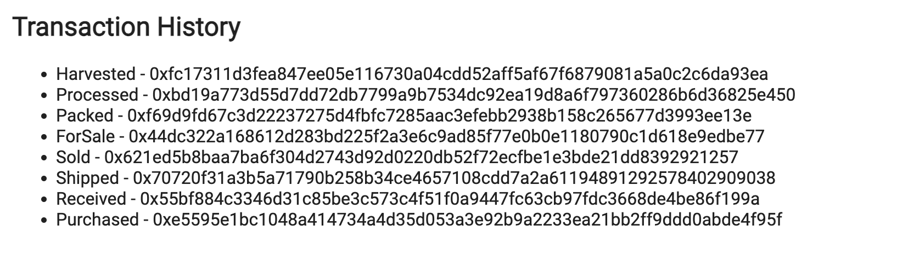
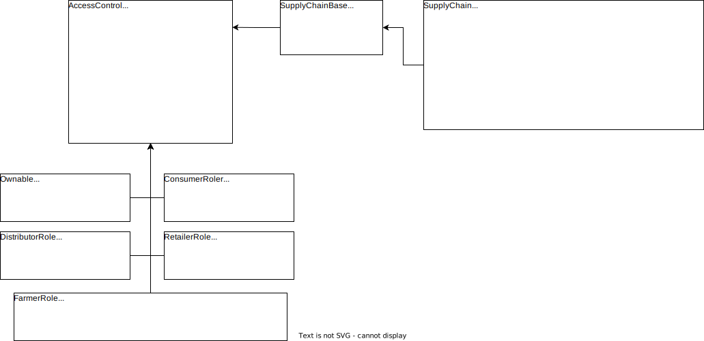
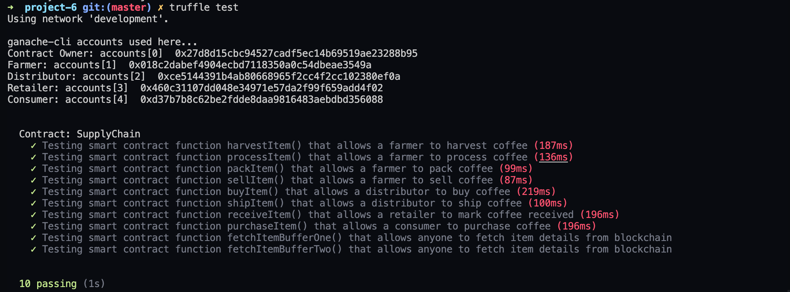

# Supply chain & data auditing

This repository containts an Ethereum DApp that demonstrates a Supply Chain flow between a Seller and Buyer. The user story is similar to any commonly used supply chain process. A Seller can add items to the inventory system stored in the blockchain. A Buyer can purchase such items from the inventory system. Additionally a Seller can mark an item as Shipped, and similarly a Buyer can mark an item as Received.

###### [Contract Address On Rinkeby: 0x22d2e60b80079542e0d6c72a04a39ea1775b3f0a](https://rinkeby.etherscan.io/address/0x22d2e60b80079542e0d6c72a04a39ea1775b3f0a)


### Transaction History From dApp



[Harvested](https://rinkeby.etherscan.io/tx/0xfc17311d3fea847ee05e116730a04cdd52aff5af67f6879081a5a0c2c6da93ea) | [Processed](https://rinkeby.etherscan.io/tx/0xbd19a773d55d7dd72db7799a9b7534dc92ea19d8a6f797360286b6d36825e450) | [Packed](https://rinkeby.etherscan.io/tx/0xf69d9fd67c3d22237275d4fbfc7285aac3efebb2938b158c265677d3993ee13e) | [ForSale](https://rinkeby.etherscan.io/tx/0x44dc322a168612d283bd225f2a3e6c9ad85f77e0b0e1180790c1d618e9edbe77) | [Sold](https://rinkeby.etherscan.io/tx/0x621ed5b8baa7ba6f304d2743d92d0220db52f72ecfbe1e3bde21dd8392921257) | [Shipped](https://rinkeby.etherscan.io/tx/0x70720f31a3b5a71790b258b34ce4657108cdd7a2a61194891292578402909038) | [Received](https://rinkeby.etherscan.io/tx/0x55bf884c3346d31c85be3c573c4f51f0a9447fc63cb97fdc3668de4be86f199a) | [Purchased](https://rinkeby.etherscan.io/tx/0xe5595e1bc1048a414734a4d35d053a3e92b9a2233ea21bb2ff9ddd0abde4f95f)


## UML Diagrams
#### Activity Diagram

#### Sequence Diagram

#### Class Diagram

#### State Diagram


## Getting Started

These instructions will get you a copy of the project up and running on your local machine for development and testing purposes. See deployment for notes on how to deploy the project on a live system.

### Prerequisites

```
node v16.14.0
truffle v4.1.14
solidity v0.4.24
```

## Test locally

```
git clone https://github.com/rexdavinci/udacity-supplychain-dapp
```

Change directory to ```project-6``` folder and install all requisite npm packages (as listed in ```package.json```):

```
cd project-6
npm install
```

Launch Ganache:

```
ganache-cli -m "spirit supply whale amount human item harsh scare congress discover talent hamster"
```

```
truffle test
```

All 10 tests should pass.



In a separate terminal window, launch the DApp:

```
npm run dev
```

## Built With

* [Ethereum](https://www.ethereum.org/) - Ethereum is a decentralized platform that runs smart contracts
to make the web faster, safer, and more open.
* [Truffle Framework](http://truffleframework.com/) - Truffle is the most popular development framework for Ethereum with a mission to make your life a whole lot easier.
* [web3.js](https://readthedocs.org/projects/web3js/) - web3.js is a collection of libraries that allow you to interact with a local or remote ethereum node using HTTP, IPC or WebSocket..


## Authors

See also the list of [contributors](https://github.com/rexdavinci/udacity-supplychain-dapp/contributors.md) who participated in this project.

## Acknowledgments

* Solidity
* Ganache-cli
* Truffle
